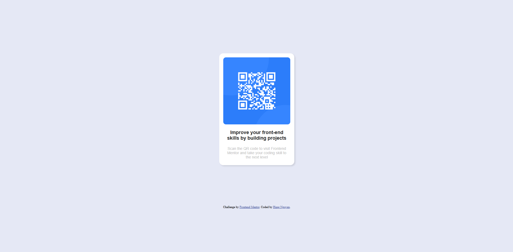

# Frontend Mentor - QR code component solution

This is a solution to the [QR code component challenge on Frontend Mentor](https://www.frontendmentor.io/challenges/qr-code-component-iux_sIO_H). Frontend Mentor challenges help you improve your coding skills by building realistic projects.

## Table of contents

- [Overview](#overview)
  - [Screenshot](#screenshot)
  - [Links](#links)
- [My process](#my-process)
  - [Built with](#built-with)
  - [What I learned](#what-i-learned)
  - [Continued development](#continued-development)
  - [Useful resources](#useful-resources)
- [Author](#author)
- [Acknowledgments](#acknowledgments)

## Overview

### Screenshot

#### Screenshot for desktop



#### Screenshot for phone


### Links

- Solution URL: [solution URL](https://github.com/hung1503/CSS-practice/tree/main/qr-code-component-main)
- Live Site URL: [live site URL](https://your-live-site-url.com)

## My process

### Built with

- Semantic HTML5 markup
- CSS custom properties
- Flexbox

### What I learned

After the practice, I learned more about CSS porperties and get used to styling the components.

To see how you can add code snippets, see below:

```html
<div class="container">
  
  <div class="title">Improve your front-end skills by building projects</div>
  <div class="description">
    Scan the QR code to visit Frontend Mentor and take your coding skill to the
    next level
  </div>
</div>
```

```css
.container {
  background-color: white;
  margin-top: 200px;
  padding: 15px 15px 22px;
  width: 250px;
  font-family: Arial, Helvetica, sans-serif;
  text-align: center;
  border-radius: 15px;
  display: flex;
  flex-direction: column;
  justify-content: center;
  align-items: center;
  box-shadow: 4px 4px 5px rgba(0, 0, 0, 0.1);
}
```

### Continued development

I want to practice my styling with CSS and HTML more in the future. I want to get familiar with the CSS properties and how to use them effectively.

### Useful resources

- [Youtube course](https://www.youtube.com/watch?v=G3e-cpL7ofc&list=WL&index=2&t=23364s) - This helped me to recall all the basic of HTML&CSS.

## Author

- Website - [Hung Nguyen](https://portfolio-2024-59zr.vercel.app/)
- Frontend Mentor - [@hung1503](https://www.frontendmentor.io/profile/hung1503)
